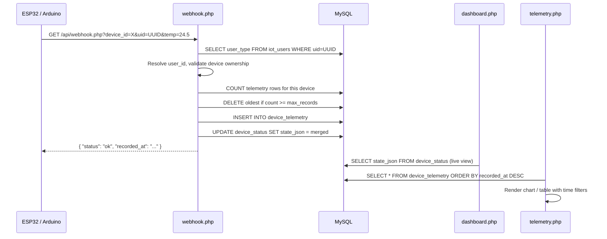

# Webhook Feature — Brainstorm & Design (v2)

## The Problem

Currently, the IoT dashboard only supports a **push model**: the dashboard (or ESP32) writes state via `write.php`, and the dashboard reads it via `read.php`. There is no mechanism for devices to **report data back** (sensor readings, telemetry, events) in a way that gets stored as a historical timeline. The `device_status` table only holds the *latest* state — it overwrites on every update.

A webhook endpoint would allow microcontrollers to **POST data** to the server, which then gets logged with timestamps, enabling historical charts, alerts, and data export.

---

## Confirmed Decisions

### 1. Hybrid Model ✅

- **Dashboard**: Show the webhook URL per device (alongside the existing ESP32 Connection URL). Add a "View telemetry →" link.
- **Separate `telemetry.php` page**: Dedicated view for historical data with charts, tables, filters, and export.

### 2. Dual Ingestion (GET + POST) ✅

Both methods supported for maximum device compatibility:

```
# GET — for constrained microcontrollers
GET /iot/api/webhook.php?device_id=esp32-kitchen&uid=a1b2c3d4&temperature=24.5&humidity=61

# POST — for richer payloads
POST /iot/api/webhook.php?device_id=esp32-kitchen&uid=a1b2c3d4
Content-Type: application/json
{ "temperature": 24.5, "humidity": 61, "motion": 1 }
```

### 3. Live State Sync (Option B) ✅

When a webhook arrives, it **both** logs to `device_telemetry` AND updates `device_status.state_json`. The dashboard immediately reflects the latest sensor readings.

However, the **device read endpoint** (`read.php`) must return a **simplified flat JSON** when accessed by a device (not the full typed state). This is already handled by the existing `format` param — the default returns flat key-value pairs:

```json
// Default response from read.php (what the device gets):
{ "temperature": 24.5, "humidity": 61, "led_1": 1 }

// Full response (format=full, used by the dashboard):
{
  "device_id": "esp32-kitchen",
  "state": { "temperature": 24.5, "humidity": 61, "led_1": 1 },
  "typed_state": { ... },
  "last_seen": "2026-04-18 18:45:00"
}
```

> [!TIP]
> The existing `read.php` already does this correctly. No change needed on the read side — devices get the simple flat JSON by default.

---

## Authentication: UID System

### Problem with Current Approach

The current system uses a numeric `user_id` (auto-increment integer) in API URLs:

```
/api/read.php?device_id=esp32&user_id=1
```

This is **insecure** — IDs are sequential and guessable. Anyone could enumerate user IDs and access devices.

### Solution: Add a `uid` Column (UUID)

Add a unique, non-guessable identifier to each user. This `uid` is what gets embedded in device URLs instead of the numeric `id`.

#### ALTER TABLE Queries

```sql
-- Step 1: Add uid column to iot_users
ALTER TABLE iot_users
  ADD COLUMN uid VARCHAR(36) NOT NULL DEFAULT '' AFTER id;

-- Step 2: Generate UIDs for existing users
UPDATE iot_users SET uid = UUID() WHERE uid = '';

-- Step 3: Add unique index
ALTER TABLE iot_users
  ADD UNIQUE INDEX idx_uid (uid);

-- Step 4: Add user_type column for tier system
ALTER TABLE iot_users
  ADD COLUMN user_type ENUM('free', 'premium') NOT NULL DEFAULT 'free' AFTER uid;
```

After migration, the `iot_users` table looks like:

```
id  | uid                                  | user_type | name | email          | ...
----|--------------------------------------|-----------|------|----------------|----
1   | f47ac10b-58cc-4372-a567-0e02b2c3d479 | free      | John | john@email.com | ...
2   | 7c9e6679-7425-40de-944b-e07fc1f90ae7 | premium   | Jane | jane@email.com | ...
```

#### Updated API URLs

All device-facing URLs now use `uid` instead of `user_id`:

```
# Before (guessable):
/api/read.php?device_id=esp32-kitchen&user_id=1

# After (secure):
/api/read.php?device_id=esp32-kitchen&uid=f47ac10b-58cc-4372-a567-0e02b2c3d479
```

#### Code Changes Needed

Update `resolve_read_user_id()` in `auth_helpers.php`:

```php
function resolve_uid_to_user_id($conn) {
    if (is_user_logged_in()) {
        return get_logged_in_user_id();
    }

    $uid = trim($_GET['uid'] ?? '');
    if ($uid === '') {
        http_response_code(401);
        echo json_encode(["error" => "Missing uid"]);
        exit;
    }

    $stmt = $conn->prepare('SELECT id FROM iot_users WHERE uid = ? LIMIT 1');
    $stmt->bind_param('s', $uid);
    $stmt->execute();
    $stmt->bind_result($userId);

    if (!$stmt->fetch()) {
        $stmt->close();
        http_response_code(401);
        echo json_encode(["error" => "Invalid uid"]);
        exit;
    }

    $stmt->close();
    return (int)$userId;
}
```

> [!WARNING]
> **Migration required**: All existing ESP32 devices will need their `serverUrl` updated to use the new `uid` param. The dashboard's connection URL display must also switch from showing `user_id=X` to `uid=XXXXX`.

---

## User Tier System & Data Caps

### No Retention Days — Use Max Record Caps Instead

Instead of auto-deleting data by age, we cap the **total number of telemetry records** per device based on the user's tier.

#### Tier Definitions

| Tier | Max Records Per Device | Notes |
|------|----------------------|-------|
| `free` | 500 | Oldest records auto-deleted when cap is hit |
| `premium` | 10,000 | Higher cap, expandable later |

#### How It Works

1. When `webhook.php` receives data, it checks the user's `user_type`.
2. It counts existing telemetry rows for that `(user_id, device_id)`.
3. If count >= max allowed, delete the oldest row(s) before inserting the new one.
4. This creates a **rolling window** — always keeps the most recent N records.

#### Implementation Logic (in `webhook.php`)

```php
// Get user tier
$tierStmt = $conn->prepare('SELECT user_type FROM iot_users WHERE id = ? LIMIT 1');
$tierStmt->bind_param('i', $userId);
$tierStmt->execute();
$tierStmt->bind_result($userType);
$tierStmt->fetch();
$tierStmt->close();

$maxRecords = ($userType === 'premium') ? 10000 : 500;

// Count existing records
$countStmt = $conn->prepare('SELECT COUNT(*) FROM device_telemetry WHERE user_id = ? AND device_id = ?');
$countStmt->bind_param('is', $userId, $deviceId);
$countStmt->execute();
$countStmt->bind_result($currentCount);
$countStmt->fetch();
$countStmt->close();

// If at cap, delete oldest to make room
if ($currentCount >= $maxRecords) {
    $overflow = $currentCount - $maxRecords + 1;
    $deleteStmt = $conn->prepare(
        'DELETE FROM device_telemetry WHERE user_id = ? AND device_id = ? ORDER BY recorded_at ASC LIMIT ?'
    );
    $deleteStmt->bind_param('isi', $userId, $deviceId, $overflow);
    $deleteStmt->execute();
    $deleteStmt->close();
}
```

> [!NOTE]
> The tier limits can easily be adjusted later. If you add more tiers (e.g., `pro`), just expand the ENUM and add a case in the limit logic. You could also move the limits to a config table if needed.

---

## Database Schema

### Existing Table (reference)

```sql
device_status (
  id            INT AUTO_INCREMENT PRIMARY KEY,
  device_id     VARCHAR(50),
  user_id       INT,
  state_json    TEXT,
  last_seen     TIMESTAMP DEFAULT CURRENT_TIMESTAMP ON UPDATE CURRENT_TIMESTAMP
)
```

### New Table: `device_telemetry`

```sql
CREATE TABLE device_telemetry (
  id          BIGINT UNSIGNED AUTO_INCREMENT PRIMARY KEY,
  user_id     INT NOT NULL,
  device_id   VARCHAR(50) NOT NULL,
  payload     JSON NOT NULL,
  recorded_at TIMESTAMP DEFAULT CURRENT_TIMESTAMP,

  INDEX idx_user_device    (user_id, device_id),
  INDEX idx_device_time    (device_id, recorded_at),
  INDEX idx_user_time      (user_id, recorded_at)
) ENGINE=InnoDB;
```

### Altered Table: `iot_users`

```sql
-- After migration, the table has these new columns:
-- uid         VARCHAR(36) NOT NULL UNIQUE   — UUID for API auth
-- user_type   ENUM('free', 'premium')       — tier for data caps
```

---

## Data Pipeline



---

## API Endpoints Summary

| Endpoint | Method | Auth | Purpose |
|----------|--------|------|---------|
| `api/webhook.php` | GET / POST | `uid` param | Receive telemetry from devices |
| `api/telemetry_read.php` | GET | Session or `uid` | Fetch historical data (paginated) |
| `api/telemetry_delete.php` | GET | Session (logged in) | Clear telemetry for a device |
| `api/read.php` | GET | Session or `uid` | Read live state (**existing**, updated to use `uid`) |
| `api/write.php` | GET | Session | Write state from dashboard (**existing**) |

---

## Arduino / ESP32 Example Code

```cpp
// Updated to use uid instead of user_id
String webhookUrl = serverUrl + "/api/webhook.php";
webhookUrl += "?device_id=" + deviceId;
webhookUrl += "&uid=" + userUid;  // UUID string
webhookUrl += "&temperature=" + String(temperature, 1);
webhookUrl += "&humidity=" + String(humidity, 0);
webhookUrl += "&motion=" + String(motionDetected);

http.begin(webhookUrl);
int httpCode = http.GET();
http.end();
```

---

## File Structure (Proposed)

```
iot/
├── api/
│   ├── webhook.php           [NEW]    — Telemetry ingestion endpoint
│   ├── telemetry_read.php    [NEW]    — Query historical data
│   ├── telemetry_delete.php  [NEW]    — Clear telemetry data
│   ├── auth_helpers.php      [MODIFY] — Add resolve_uid_to_user_id()
│   ├── read.php              [MODIFY] — Switch from user_id to uid param
│   └── ... (existing files unchanged)
├── telemetry.php             [NEW]    — Telemetry viewer page
├── dashboard.php             [MODIFY] — Show webhook URL, add telemetry link
└── ... (existing files)
```

---

## Migration Checklist

1. Run ALTER TABLE queries on `iot_users` (add `uid`, `user_type`)
2. Create `device_telemetry` table
3. Update `auth_helpers.php` with `resolve_uid_to_user_id()`
4. Update `read.php` to accept `uid` param (keep `user_id` as fallback temporarily)
5. Create `api/webhook.php`
6. Create `api/telemetry_read.php`
7. Create `telemetry.php` page
8. Update `dashboard.php` to show webhook URL and telemetry link
9. Update ESP32 example code with new `uid`-based URLs
